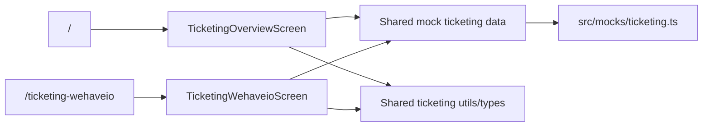

# Wehave Ticketing Overview

A small React + TypeScript + Vite take-home app for visualizing sponsor ticket allocations across upcoming football matchdays.

This repo includes two route-level design takes on the same ticketing problem:

| Route | Purpose |
| --- | --- |
| `/` | A freer design direction showing how I would approach the overview from scratch. |
| `/ticketing-wehaveio` | A second version adapted more closely to the provided `wehave.io` styling and UI language. |

Added [`DEVELOPMENT.md`](/Users/mathios/Desktop/wehave-tickets/DEVELOPMENT.md) to discuss broader context and how this could be managed inside a larger repository.

## Route Map

## Pages

### `/`

- The original take-home implementation.
- Section-based overview grouped by stadium area.
- Sponsor rows with season totals and per-matchday counts.
- Matchday details drawer connected through query params.

### `/ticketing-wehaveio`

- Styling adapted more closely to the provided `wehave.io` reference.
- Same shared ticketing data and behavior, but a different visual treatment.
- Cleaner admin-toolbar feel, grouped section cards, and a restyled details panel.

## What It Includes

- Section-based ticketing overview grouped by stadium area.
- Sponsor rows with season totals and per upcoming matchday metrics.
- Toggleable `Distributed`, `Allocated`, and `Pending` display modes.
- Matchday details drawer with ticket-level mock data.
- Shared ticketing mocks, types, and helper logic reused across both routes.
- Route-level and feature-level tests for the key interaction flows.

## Test Coverage

The current test suite focuses on behavior that matters most for the take-home:

- Route coverage in [`App.test.tsx`](/Users/mathios/Desktop/wehave-tickets/src/app/App.test.tsx)
  Confirms `/` and `/ticketing-wehaveio` resolve to different screens.
- Existing overview coverage in [`TicketingOverviewScreen.test.tsx`](/Users/mathios/Desktop/wehave-tickets/src/features/ticketing/screens/TicketingOverviewScreen.test.tsx)
  Covers grouped sections, filtering, status switching, section collapsing, and drawer behavior.
- `wehave.io` overview coverage in [`TicketingWehaveioScreen.test.tsx`](/Users/mathios/Desktop/wehave-tickets/src/features/ticketing-wehaveio/screens/TicketingWehaveioScreen.test.tsx)
  Covers the alternate route’s rendering, filtering, sort/status interaction, collapse behavior, and details drawer.

## Structure

| Area | Responsibility |
| --- | --- |
| `src/features/ticketing` | Original overview route and UI components |
| `src/features/ticketing-wehaveio` | Styling-aligned alternate route |
| `src/mocks/ticketing.ts` | Shared mock data |
| `src/shared/ticketing/*` | Shared ticketing types and helper logic |
| `src/app/*` | Router and app-level tests |

## Stack

- React 19
- TypeScript
- Vite
- Tailwind CSS v4
- React Router
- Vitest + Testing Library
- ESLint + Prettier

## Scripts

- `bun run dev` starts the local dev server.
- `bun run build` creates the production build.
- `bun run lint` runs ESLint.
- `bun run test` runs the test suite.
- `bun run format` formats the repo with Prettier.

## Notes

- All data is mock data tailored for the UI exercise.
- Both routes reuse the same shared mock ticketing data and core logic.
- The drawer state is reflected in the URL through query params.
- The interface is intentionally minimal and tuned to the provided references rather than built as a generic admin dashboard.
- For this take-home, I used custom components rather than adding a component library dependency.
